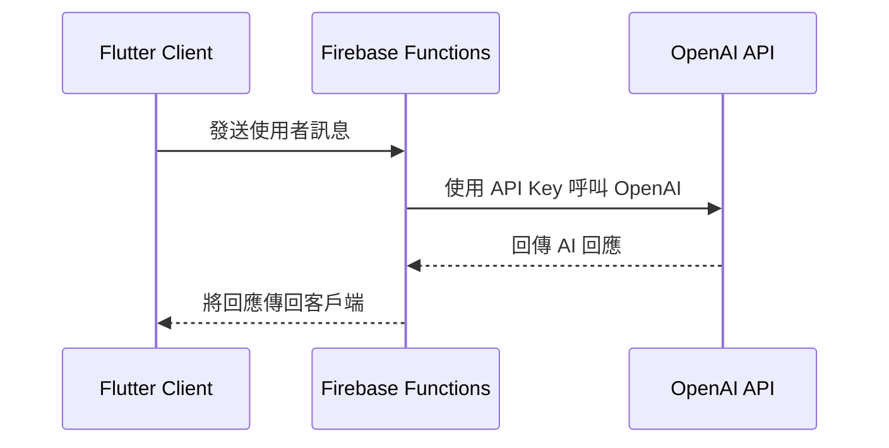
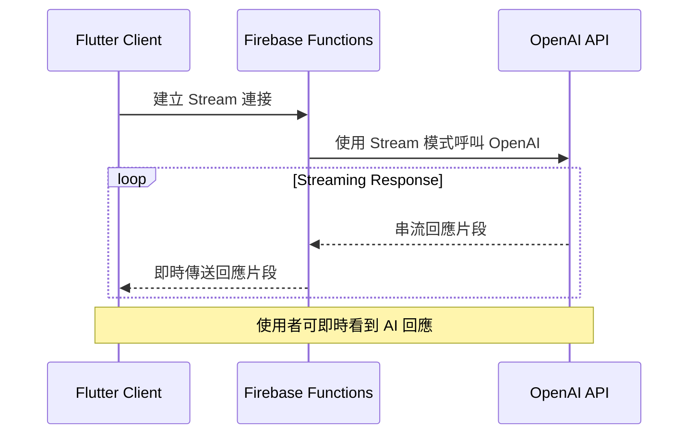

# 記憶吐司相關說明

## Client to OPENAI via backend系統架構

為了確保 OpenAI API Key 的安全性，我們採用 Firebase Functions 作為後端服務，避免在客戶端直接呼叫 OpenAI API。以下是系統的基本架構流程：

### 目前實作方式
- Flutter 客戶端發送請求到 Firebase Functions
- Firebase Functions 使用安全存儲的 API Key 呼叫 OpenAI
- 收到完整回應後，將結果傳回客戶端

### 未來優化方向
計畫實作 Stream Response 方式，讓使用者體驗更即時的回應：

### Stream 模式優勢
- 更快的初始回應時間
- 即時顯示 AI 回應內容
- 提升使用者體驗
- 減少等待完整回應的時間
- 我另一個專案已實作 (在個人網站中)

## Flutter Clean Architecture
- 本專案沒用，但其它較大型專案有使用Clean Architecture，走api/db -> repository(dtos -> entity) -> use case -> getx -> widget