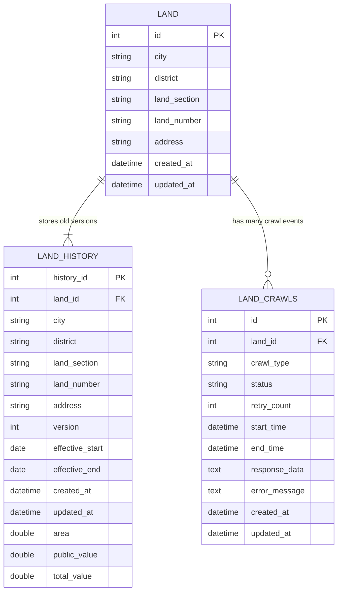

## 爬蟲系統

- 使用幾個容器並deploy為microservices支撐本服務
- 後端使用asp.net 9, postgresql, rabbitmq等開發(on AWS)
- 前端使用react 19, swr, zustand等開發(on Vercel)
- 有使用electron開發別的部份

### DEMO Code 說明(僅提供後端)
- /Controllers/AuthController.cs 展示驗證與argon 2 密碼處理
- /Migrations 使用donetef機制處理migration / seed等資料庫行為
- /Middlewares/GlobalAuthorizationMiddleware.cs 處理api middleware
- 使用AI產生postman json

### 後端：Database規劃 (只提供局部)


### 後端：系統架構
```mermaid
graph TB
    subgraph Frontend
        Next[Next.js Frontend]
    end

    subgraph Backend
        API[ASP.NET Web API]
        DB[(PostgreSQL)]
        MQ[RabbitMQ]
    end

    subgraph Crawler
        PS[Python Service]
        Spider[Web Crawler]
    end

    %% Frontend to Backend
    Next -->|API Calls| API

    %% Backend Components
    API -->|Read/Write| DB
    API -->|Publish Crawl Request| MQ

    %% Crawler Components
    MQ -->|Consume Crawl Request| PS
    PS -->|Execute| Spider
    PS -->|Publish Complete| MQ
    API -->|Subscribe Complete| MQ
    API -->|Update Status| DB

    %% Styling
    classDef frontend fill:#f9f,stroke:#333,stroke-width:2px
    classDef backend fill:#bbf,stroke:#333,stroke-width:2px
    classDef crawler fill:#bfb,stroke:#333,stroke-width:2px

    class Next frontend
    class API,DB,MQ backend
    class PS,Spider crawler

### 前端：
- 使用react 19, swr, zustand等開發
- 使用shadcn + tailwind + langflow製作UI Kit
- 使用n8n產生Storybook