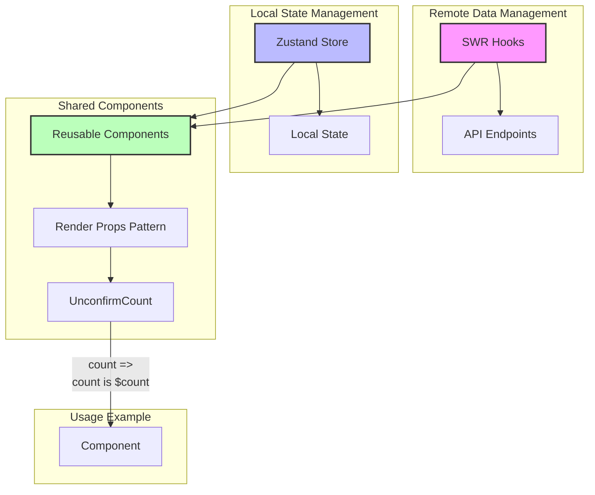

## 寵物後台系統

- 本平台我只有負責後台的"前端"功能。
- 無多語系
- 只釋出局部程式
- 寫核心的library: services/apiClient.ts / hooks/usePublicFetch.ts 等
- 因user要求使用radiux，並改依antd部份功能實作

## 關於其它後台經驗
- 新專案重構案，將新舊專案同時利用micro serivce方式先行合併共用
- 製作10款以上後台或CRM系統 (前後端)
- 心電圖等圖像製作


## Component / SWR / Zustand 設計模式



### 架構說明

1. **Remote Data (SWR)**
   - 處理所有遠端 API 請求
   - 自動快取和重新驗證
   - 提供資料加載狀態

2. **Local State (Zustand)**
   - 管理本地狀態
   - 提供簡單的狀態共享機制
   - 無需 Provider 包裝

3. **Shared Components**
   - 使用 Render Props 模式
   - 封裝共用的資料邏輯
   - 提供靈活的渲染方式
   - 大量運作在 PermissionCheck 的component中

4. **使用範例**
```tsx
<UnconfirmCount>
  {(count) => <div>count is {count}</div>}
</UnconfirmCount>
